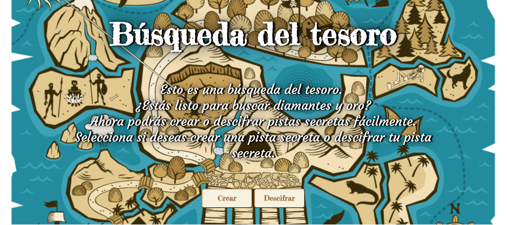
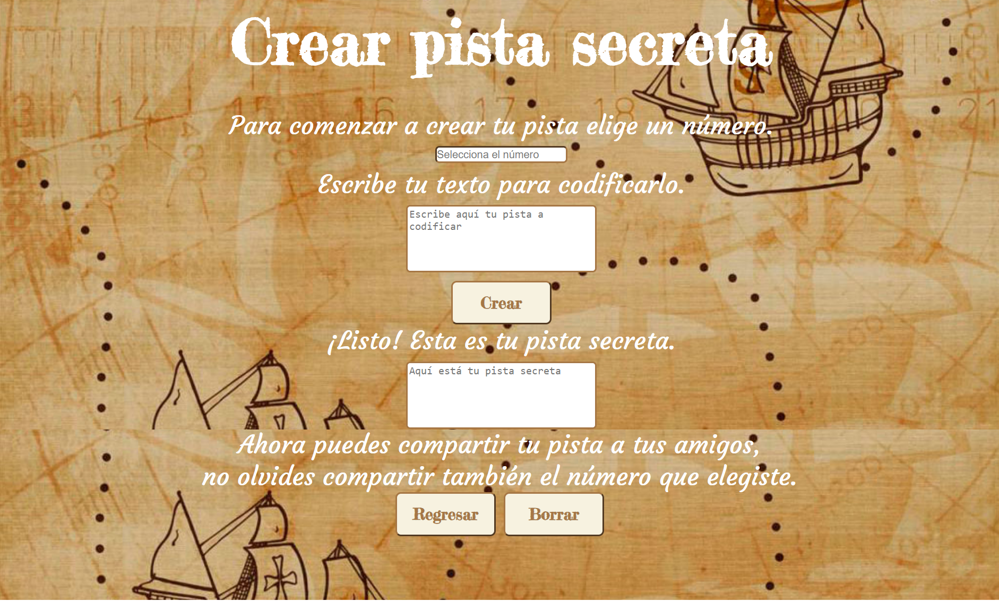
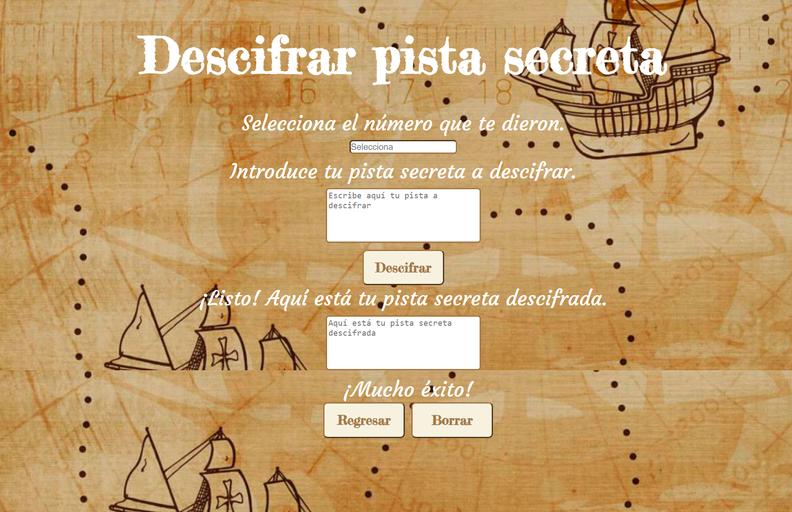

# Búsqueda del tesoro

La búsqueda del tesoro es un juego que a los niños de todas las edades les encanta. Es un juego muy completo porque tienen que pasar una serie de pruebas, pensar en las pistas que les dan para encontrar el tesoro y además juegan con más niños.

Con la página **Búsqueda del tesoro** puedes crear pistas y decodificarlas fácilmente.
Lo único que necesitas es elegir un número que nos ayudará a desplazar el texto, introducir tu texto a codificar y ¡Listo!, tu pista ha sido creada. Para poder compartirla con tus jugadores, debes indicarles el número que elegiste y tu pista creada.
Al descifrar tus pistas necesitas ingresar el número y la pista secreta que te dieron, la página se encarga de lo demás.

Esto se logra utilizando el *cifrado césar*, que es una de las técnicas más simples para cifrar un mensaje. Es un tipo de cifrado por sustitución, es decir que cada letra del texto original es reemplazada por otra que se encuentra un número fijo de posiciones (desplazamiento) más adelante en el mismo alfabeto.El usuario puede ingresar el mensaje que guste con números, mayúsculas, minúsculas, espacios, caracteres especiales y además puede elegir el número de desplazamiento que desee.


## Pre-requisitos e instalación
1. Antes que nada, asegúrate de tener un editor de texto en
   condiciones, algo como [Atom](https://atom.io/), 
   [Visual Code](https://code.visualstudio.com/), [Sublime Text](https://www.sublimetext.com) o cualquier otro de tu preferencia.
2. Para ejecutar los comandos a continuación necesitarás una
   [UNIX Shell](https://github.com/Laboratoria/curricula-js/tree/v2.x/topics/shell),
   que es un programita que interpreta líneas de comando (command-line
   interpreter) así como tener [git](https://github.com/Laboratoria/curricula-js/tree/v2.x/topics/scm/01-git)
   instalado. Si usas un sistema operativo "UNIX-like", como GNU/Linux o MacOS,
   ya tienes una _shell_ (terminal) instalada por defecto (y probablemente `git`
   también). Si usas Windows puedes usar [Git bash](https://git-scm.com/download/win),
   aunque recomendaría que consideres probar GNU/Linux como tu Sistema Operativo.
3. Haz tu propio [fork](https://help.github.com/articles/fork-a-repo/)
   de [ este repositorio](https://github.com/Cristalgarcia/cdmx-2019-01-bc-core-am-cipher) de tu cohort.
4. [Clona](https://help.github.com/articles/cloning-a-repository/)
   tu _fork_ a tu computadora (copia local).
5. Instala las dependencias del proyecto con el comando `npm
   install`. Esto asume que has instalado [Node.js](https://nodejs.org/) (que
   incluye [npm](https://docs.npmjs.com/)).
6. Si todo ha ido bien, deberías poder ejecutar las :traffic_light:
   pruebas unitarias (unit tests) con el comando `npm run test`.

## Consideraciones técnicas

Este proyecto está desarrollado con:
- EMS6 JavaScript puro [JSVanilla](https://medium.com/laboratoria-developers/vanillajs-vs-jquery-31e623bbd46e).
-CSS3
-HTML5
- Se realizaron [pruebas unitarias]() para validar la funcionalidad de codificación y decodificación. Estos test se implementaron con [Mocha](https://mochajs.org/) y assertion library de [Chai](https://www.chaijs.com/).
- Como gestor de proyecto de utilizó NPM (Node Package Manager).
## Pruebas
Las pruebas automatizadas para este sistema requieren de una instalación simple a través del comando npm install. Los tests verifican que regrese una letra acorde a la posición ingresada en el offset. Analiza que la función  cifrar retorne "HIJKLMNOPQRSTUVWXYZABCDEFG" para "ABCDEFGHIJKLMNOPQRSTUVWXYZ" con offset 33; y que la función descifrar retorne retornar "ABCDEFGHIJKLMNOPQRSTUVWXYZ" para "HIJKLMNOPQRSTUVWXYZABCDEFG" con offset 33. No cifra caracteres especiales y espacios (" !@" debería retornar  " !@"', ).

### Estilo
El _boilerplate_ contiene una estructura de archivos como punto de partida así
como toda la configuración de dependencias y tests de ejemplo:
```text
./
├── .editorconfig
├── .eslintrc
├── .gitignore
├── README.md
├── package.json
├── src
│   ├── cipher.js
│   ├── index.html
│   ├── index.js
│   └── style.css
└── test
    ├── cipher.spec.js
    ├── headless.js
    └── index.html
```
El _boilerplate_ incluye tareas que ejecutan [eslint](https://eslint.org/) y
[htmlhint](https://github.com/yaniswang/HTMLHint) para verificar el `HTML` y
`JavaScript` con respecto a unas guías de estilos. Ambas tareas se ejecutan
automáticamente antes de ejecutar las pruebas (tests) cuando usamos el comando
`npm run test`. En el caso de `JavaScript` estamos usando un archivo de
configuración de `eslint` que se llama `.eslintrc` que contiene un mínimo de
información sobre: qué version de JavaScript/ECMAScript, el
entorno (browser en este caso) y las [reglas recomendadas (`"eslint:recommended"`)](https://eslint.org/docs/rules/).
En cuanto a reglas/guías de estilo en sí,
usaremos las recomendaciones _por defecto_ de tanto `eslint` como `htmlhint`.
# UX-UI
El proyecto se dio como resultado de la convivencia cercana que se tiene con los niños. Esto nos permitió darnos cuenta de que actualmente los niños están muy familiarizados con la tecnología y aunque esto es bueno, también los ha alejado de la interacción con otros niños o personas. 
Este proyecto pretende ayudar de forma didáctica a integrar tanto la tecnología como la socialización. Ayuda tanto a maestros, padres y niños para organizar fácilmente juegos de Búsqueda del tesoro; así como a los jugadores a descifrar sus pistas de forma fácil y entretenida.

El proyecto está enfocado principalmente en niños de 8-12 años, pero su interfaz sencilla de manejar permite que niños más pequeños o adultos puedan utilizarla fácilmente.


En las investigaciones se descubrió que la palabra *tesoro*, es asociada generalmente a un contexto de piratas; por lo cual todo el diseño se realizó con base en eso.

Desde el inicio se tuvo claridad en cuanto al esqueleto  (HTML) de la página, siendo la apariencia la que se modificó varias veces. Se utilizaron predominantemente los colores café,azul y blanco por su facilidad de combinación y contraste.
El primer sketch se puede revisar en: https://marvelapp.com/4cd6dh7.
Siendo el resultado final el siguiente:




## Autores
-Brenda Alejandra Vasquez Orozco (Brendss)
## Expresiones de gratitud
Agradezco a Dios, el apoyo de mi squad "Guacacoders",a los coaches y a Laboratoria.